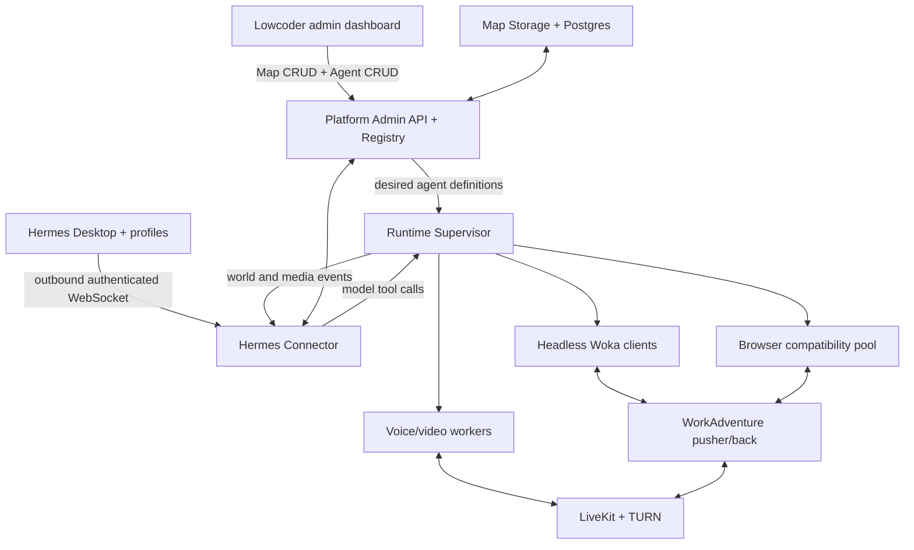
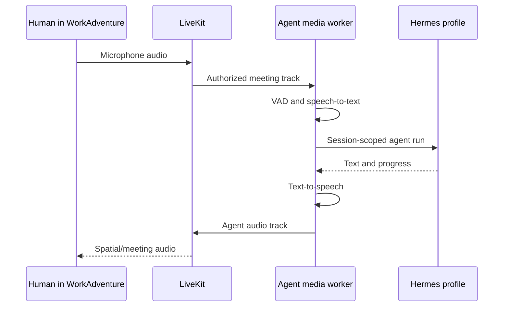

# WorkAdventure × Hermes Agent Platform Blueprint

Status: approved; Phases 0–2 completed, with Phase 3 next.

Prepared for: William Hankey  
Date: 24 August 2026 (Africa/Johannesburg)

## 1. Executive decision

Build this as a hybrid agent platform, not as a map script and not as a Lowcoder-only integration.

- WorkAdventure remains the spatial world, presence system, Woka/avatar renderer, chat surface, and LiveKit/WebRTC media layer.
- Hermes remains the agent brain, with one isolated Hermes profile per in-world agent.
- A new platform service exposes a deliberately narrow administration API to Lowcoder: map CRUD and agent CRUD only.
- A lightweight Hermes Connector runs next to Hermes Desktop and connects outward to the control plane, so no Hermes key or terminal-capable API is exposed to the public internet.
- Each active agent is controlled by the model configured in its bound Hermes profile. WorkAdventure events become Hermes input; Hermes tool calls become validated agent actions.
- The normal runtime is a lightweight headless WorkAdventure protocol client. It creates a real visible participant without one Chromium process per agent.
- A browser compatibility runtime is available for WorkAdventure actions that cannot be reproduced safely through the headless runtime. This is how the final system reaches full normal-user capability without making every agent expensive.
- Voice and video are separate media workers attached to the same WorkAdventure identity. Voice uses speech-to-text → Hermes → text-to-speech; video publishes a synthetic avatar camera track.

Lowcoder never becomes an agent joystick or model runner. It defines maps and agent records; Hermes supplies every agent's decisions and live behavior. This protects profile isolation and scales more efficiently than WorkAdventure's official headless-browser bot model.

## 2. Important findings from the audit

### 2.1 What the official WorkAdventure APIs can and cannot do

| API | Transport | Best use here | Important limitation |
| --- | --- | --- | --- |
| Scripting API | Browser/iframe JavaScript | Supported movement, nearby-player events, bubble chat, status, meeting audio helpers, map UI | Runs inside each player's browser; it is not a server API that can create a participant. Scripts normally affect only their local player. |
| Map Storage API | REST | Upload/read/patch/delete WAM/TMJ/assets from the control plane | Manages maps, not users or autonomous participants. |
| Room API | gRPC/HTTP2 | Shared room variables and server-to-room state | Lowcoder should not call it directly; it does not create users or manage movement/media. |
| Inbound API | REST | SaaS member administration | Not available to the normal self-hosted edition and currently focuses on members, not runtime bots. |

Official API overview: [WorkAdventure developer APIs](https://docs.workadventu.re/developer/). The Scripting API explicitly runs in the browser and warns that changes are local unless state is shared through events or variables: [Map Scripting API](https://docs.workadventu.re/developer/map-scripting/). The self-hosted REST map lifecycle is documented in the [Map Storage API](https://docs.workadventu.re/developer/map-storage-api/), while the [Room API](https://docs.workadventu.re/developer/room-api/) is gRPC and room-variable focused.

### 2.2 WorkAdventure's official bot model is not part of self-hosted WorkAdventure

WorkAdventure's hosted bot system starts one headless browser for each bot and treats it as a regular connected user. The bot runs a custom script with access to the Scripting API. The current documentation labels virtual agents as unavailable in self-hosted WorkAdventure: [Virtual agents / bots](https://docs.workadventu.re/admin/bots/) and [custom-script bots](https://docs.workadventu.re/admin/bots/custom-script/).

The official approach proves that full browser automation works, but it is too resource-heavy to be the only runtime on William's 4-vCPU server. It remains useful as a compatibility mode.

### 2.3 The community bot example is too limited for this target

The Awesome WorkAdventure bot section currently lists Pixel, a bridge bot that also connects through WorkAdventure's version-coupled internal protocol. Its configuration requires an internal WorkAdventure version hash and it does not provide the voice/video/profile control needed here: [Awesome WorkAdventure bots](https://github.com/workadventure/awesome-workadventure#bots) and [Pixel/wa-bot](https://github.com/rllola/wa-bot).

### 2.4 William already has a valuable proof of concept

The connected GitHub account already contains [WilliamHankey/workadventure-ai-npc](https://github.com/WilliamHankey/workadventure-ai-npc), branch `ai-npc`. Its 14 August 2026 root commit implements:

- a TypeScript WebSocket/protobuf participant;
- authenticated headless OIDC login against the local mock provider;
- visible Woka identity, room presence, world/proximity spaces, and roster presence;
- waypoint movement and reconnect logic;
- speech bubbles and bubble/proximity chat handling;
- a Fastify OpenAI-compatible bridge;
- a LiveKit audio participant, Whisper transcription, Edge TTS, and audio confirmation logic;
- unit tests for important bot and bridge utilities.

This proves the difficult parts are possible. It is not yet production-ready:

- The repository is a single root snapshot with no upstream WorkAdventure history; it is not a proper GitHub network fork.
- Only the `ai-npc` branch exists, so upstream syncing and safe rebasing are poor.
- The bridge does not actually call Hermes. It calls an LLM provider directly with a copied API key and a shared Zackary persona, so Hermes skills, memory, sessions, tool progress, and per-profile identity are bypassed.
- Profiles are hard-coded as Zackary/Wally rather than discovered and mapped dynamically.
- Movement follows a square/waypoint loop and is not collision-aware.
- The voice worker uses an administrator token to list LiveKit rooms, chooses the room with the most participants, and then attaches there. That can join the wrong conversation and is unacceptable for privacy and correctness.
- Voice end-of-turn detection resets the last-speech timestamp during silence, so normal silence-based utterance completion is unreliable and may wait for the maximum utterance duration.
- The Whisper model is loaded per voice session even though a warm-up is attempted.
- No production bot/bridge/media services are wired into one reproducible Compose deployment.
- The standard upstream CI does not run the added `bot` and `bridge` test suites.
- The mock OIDC users and development secrets are not a production identity system.
- There is no map/agent administration API, persistent registry, desired-state reconciler, Hermes action gateway, ownership binding, or policy guard.
- There is no synthetic camera/video track.

### 2.5 Hermes already exposes the correct agent-side primitives

Hermes' current API server supports:

- `POST /v1/chat/completions` and the Responses API;
- `GET /v1/models`, which advertises the current profile name;
- `GET /v1/capabilities` for feature detection;
- `GET /health` and authenticated `GET /health/detailed` for liveness/readiness and active-run counts;
- `POST /v1/runs`, run polling, SSE run events, cancellation, and approvals;
- session CRUD and session chat/stream endpoints;
- stable `X-Hermes-Session-Key` scoping for long-term memory;
- isolated profiles with separate configuration, memory, skills, keys, and gateway processes;
- optional multiplex routing under `/p/<profile>/...`, with a distinct API key required for each routed profile.

Primary reference: [Hermes Agent API server](https://github.com/NousResearch/hermes-agent/blob/main/website/docs/user-guide/features/api-server.md). The profile guidance prefers independent gateway processes for hard isolation and offers multiplexing for many low-traffic profiles: [Running many gateways at once](https://github.com/nousresearch/hermes-agent/blob/main/website/docs/user-guide/multi-profile-gateways.md).

For the first production version, use one gateway process per active profile. Add multiplexing only after contract tests pass on the installed Hermes version. This avoids making the WorkAdventure platform dependent on a newer, more complex profile-routing path.

## 3. Target capability contract

"Do everything a normal user can do" will be implemented as an explicit capability contract. This prevents a vague claim from hiding unsupported or unsafe actions.

### 3.1 Required agent capabilities

| Capability | Target behavior | Primary runtime |
| --- | --- | --- |
| Physical presence | Agent appears as a normal connected Woka with name, identity, status, roster entry, and online/offline lifecycle | Headless protocol client |
| Avatar | Deterministic default Woka per Hermes profile; editable Woka layers and optional custom sprite | Headless client + Woka catalog |
| Walk | Hermes chooses when and where to walk using permitted navigation tools; runtime validates and executes paths | Hermes model + headless client + map pathfinder |
| Follow/approach | Hermes can follow or approach its bound user when context and policy allow | Hermes model + headless client |
| Text conversation | Hermes receives nearby/direct messages and chooses whether and how to answer through bubble or direct chat tools | Hermes model + headless client |
| Voice conversation | Hear consenting participants in the current meeting, transcribe, send to the bound Hermes profile, speak the reply through the agent | Media worker + LiveKit |
| Video call | Publish a virtual camera feed showing the agent's chosen avatar/talking-head representation; turn camera on/off | Media worker + LiveKit |
| Status/emotes | Online/busy/DND/away and selected emotes | Headless client |
| Meetings | Join/leave proximity or named spaces, react to participant changes, publish/subscribe media | Headless client + media worker |
| User binding | Agent CRUD connects one or more Hermes agents to William's WorkAdventure user; Hermes receives that relationship as context | Agent registry + Hermes profile |
| Autonomy policy | The Hermes profile/model controls live behavior within immutable per-agent capability limits | Hermes model + policy guard |
| Full UI parity | Co-websites, UI-only controls, future WorkAdventure features, and edge cases | Browser compatibility runtime |

WorkAdventure's supported Scripting API already exposes collision-aware `WA.player.moveTo`, player status, meeting membership, meeting audio streaming/listening, bubble chat, and nearby-player tracking. These are valuable in browser mode and useful as the behavioral reference for the lightweight client: [Player API](https://docs.workadventu.re/developer/map-scripting/references/api-player/), [Players API](https://docs.workadventu.re/developer/map-scripting/references/api-players/), [Chat API](https://docs.workadventu.re/developer/map-scripting/references/api-chat/), and [Spaces API](https://docs.workadventu.re/developer/map-scripting/references/api-spaces/).

### 3.2 Default safety policy

- Agents may walk, follow, chat, speak, listen in their active meeting, set status, use approved tools, and publish their virtual avatar video.
- Microphone listening starts only after the agent has visibly joined the meeting and the dashboard shows a listening state.
- Each agent ignores other agents' replies unless an explicit agent-to-agent task permits them, preventing feedback loops.
- Screen sharing, map editing, file upload, inviting users, moderation, and arbitrary browser navigation are disabled by default even when browser mode could perform them.
- Every sensitive capability has a per-agent allow/deny switch in the registry. Lowcoder can edit those limits through agent CRUD, but it cannot invoke the capabilities.

## 4. Architecture



### 4.1 Lowcoder boundary

Lowcoder is limited to:

- map create, read, update, and delete;
- map content/assets, validation metadata, and draft/published state;
- agent create, read, update, and delete;
- selecting a Hermes profile/model, Woka, voice, video representation, owner, world, and capability limits as fields on an AgentDefinition;
- read-only health and runtime status needed to administer those records.

Lowcoder does **not** expose movement, message, voice, video, spawn/stop, model-run, approval, or generic command endpoints. Setting an AgentDefinition to `enabled: true` declares desired state; the supervisor reconciles it and the bound Hermes model takes control.

Why this separation is required:

- Lowcoder cannot natively consume WorkAdventure's gRPC Room API.
- The Scripting API exists inside a player's browser, not as a public server endpoint.
- The internal pusher WebSocket is version-coupled and should be isolated behind one adapter.
- Hermes' API key gives access to an agent that may have terminal, file, browser, memory, and skills capabilities. It must never be placed in a Lowcoder browser or exposed through public client-side requests.
- A narrow administration contract prevents Lowcoder from becoming an operational or security bypass.

### 4.2 Component responsibilities

#### Platform Admin API and Agent Registry

Recommended stack: TypeScript, Fastify, Zod, OpenAPI, PostgreSQL, and Redis.

Responsibilities:

- authenticate Lowcoder and the local Hermes Connector;
- expose only map CRUD, agent CRUD, required read-only catalogs, and read-only status to Lowcoder;
- hold normalized map/profile/agent/binding/session/action records;
- reconcile the desired AgentDefinition state into one live runtime per enabled agent;
- enforce permissions, ownership, and the Hermes-to-agent binding on every model tool call;
- persist audit events without storing raw audio;
- never store raw Hermes profile API keys when connector proxying is used.

#### Hermes Connector

Runs on the Windows machine beside Hermes Desktop/Agent.

- discovers local Hermes profiles;
- reads profile descriptions and safe metadata but never transmits `.env` values;
- checks `/v1/capabilities`, `/health/detailed`, and the profile's advertised model;
- opens one outbound WSS connection to the control plane;
- sends WorkAdventure, conversation, and media events to the correct local profile;
- proxies profile runs/sessions and streams model tool calls and progress back to the platform;
- applies profile concurrency locks;
- reports machine sleep/offline state and reconnects with exponential backoff.

The connector should feature-detect Hermes' local `GET /api/profiles` where available, with a local profile-registry adapter as fallback. The public control-plane contract must not depend on undocumented Hermes filesystem layout.

#### Hermes Agent Driver Loop

1. The runtime emits a normalized event such as `message.received`, `user.nearby`, `meeting.joined`, `navigation.completed`, or `voice.transcript`.
2. The connector sends that event, world context, owner relationship, and current state to the agent's bound Hermes profile/session.
3. The configured model reasons and either does nothing, answers with text, or emits one or more agent tool calls.
4. The platform verifies that the tool belongs to the same agent/profile, is allowed by the AgentDefinition, and has valid arguments.
5. The runtime executes the action and returns an observation/result to Hermes so the model can continue.

The model is therefore the controller. The platform is the body, event transport, and safety guard.

#### WorkAdventure Runtime Supervisor

- starts/stops one lightweight Woka client for each active agent;
- obtains the agent's WorkAdventure service identity through production OIDC;
- handles pusher WebSocket version negotiation, nonces, ping/keepalive, reconnect, and duplicate-session protection;
- consumes exact space and LiveKit invitations for that participant;
- emits normalized presence, message, movement, meeting, and media events;
- accepts operational actions only through the authenticated Hermes action path, never from Lowcoder;
- switches an agent to browser compatibility mode only when needed.

#### Map/Pathfinding Service

- loads the current TMJ/WAM map and referenced tilesets;
- builds a collision/navigation grid;
- converts named entry points and named areas to walkable targets;
- runs A* pathfinding and emits movement at WorkAdventure's expected cadence;
- replans when the target moves or the route becomes invalid;
- provides `move_to`, `move_to_area`, `follow_user`, `approach_user`, `stop`, and `navigate_room` tools to Hermes.

#### Media Worker

- accepts only the exact LiveKit room/token invitation generated for the agent;
- subscribes only while the agent is authorized and present in that meeting;
- performs VAD/turn detection and STT, emits the transcript to Hermes, and turns Hermes' response into TTS;
- publishes an audio track linked to the same WorkAdventure space user;
- optionally publishes a synthetic video track and synchronizes camera/microphone state;
- never lists all LiveKit rooms and never chooses a room heuristically.

#### Browser Compatibility Pool

- Playwright/Chromium workers are started on demand, not per permanently parked agent;
- uses the supported Scripting API for UI-only or newly introduced capabilities;
- has strict concurrency and idle shutdown because 4 vCPU is the system's main constraint;
- remains a fallback, not the normal path.

### 4.3 Hermes agent tool and event contract

Every bound Hermes profile receives a WorkAdventure toolset scoped to exactly one AgentDefinition:

| Tool group | Hermes tools |
| --- | --- |
| Perception | `wa_get_self_state`, `wa_get_nearby_users`, `wa_get_world_context`, `wa_get_map_areas`, `wa_get_current_meeting` |
| Navigation | `wa_move_to`, `wa_move_to_area`, `wa_approach_user`, `wa_follow_user`, `wa_stop_moving`, `wa_navigate_room` |
| Conversation | `wa_say`, `wa_direct_message`, `wa_set_status`, `wa_emote` |
| Meetings/media | `wa_join_meeting`, `wa_leave_meeting`, `wa_speak`, `wa_start_video`, `wa_stop_video` |
| Compatibility | narrowly approved browser/Scripting API tools added only when lightweight parity is unavailable |

Hermes receives normalized events including agent online/offline, nearby user entered/left, text received, voice transcript, owner location change, meeting membership change, tool completion/failure, and a rate-limited observation pulse for proactive behavior. The profile's system instructions explain identity, owner relationship, current map, capability limits, and tool semantics.

Each tool call carries the Hermes profile ID, agent ID, runtime session ID, run ID, and tool-call ID. The policy guard rejects cross-agent calls, disabled capabilities, stale sessions, invalid destinations, and actions outside the configured map/meeting. Lowcoder can edit the allowlist through AgentDefinition CRUD but cannot call the tools.

## 5. Identity and data model

### 5.1 One-to-one identity chain

```text
Hermes profile
  -> AgentDefinition
  -> dedicated WorkAdventure OIDC/service identity
  -> Woka layers + voice + virtual-camera profile
  -> active RuntimeSession
  -> owner/bound WorkAdventure user
  -> Hermes conversation/session key
```

### 5.2 Core records

#### HermesProfile

- `id`, `name`, `description`
- `connector_id`, `endpoint_ref`
- `advertised_model`, `capabilities`
- `health`, `readiness`, `active_runs`, `pending_completions`
- `last_seen_at`, `profile_version`

#### AgentDefinition

- `id`, `hermes_profile_id`, `model_id`
- `display_name`, `description`
- `map_id`, `spawn_point`, `owner_workadventure_uuid`
- `woka_texture_ids[]`, `companion_texture_id`
- `voice_provider`, `voice_id`, `language`
- `video_mode`, `video_asset_ref`
- `runtime_mode`: `headless`, `browser`, or `auto`
- `control_mode`: `hermes` (required for production agents)
- `behavior_instructions`, `initiative_level`, `response_policy`
- permission object for movement, listening, speaking, video, tools, browser, and moderation
- `enabled`, `created_at`, `updated_at`

#### AgentBinding

- `agent_id`
- `owner_workadventure_uuid`
- `relationship`: `assistant`, `team_agent`, `guide`, or `unassigned`
- `follow_enabled`, `priority`

#### RuntimeSession

- `id`, `agent_id`, `world_id`, `room_url`
- WorkAdventure user UUID, numeric room user ID, space user IDs
- Hermes session ID and stable `X-Hermes-Session-Key`
- process/runtime identifiers
- lifecycle state, current position, target, meeting, media state
- timestamps, restart count, last error code

#### HermesActionInvocation

- `id`, `runtime_session_id`, `hermes_profile_id`, `tool_name`, validated arguments
- Hermes run/tool-call IDs, policy decision, status
- requested/started/completed timestamps
- normalized observation/result or safe error returned to Hermes

#### AuditEvent

- actor, agent, event type, safe metadata, timestamp
- no API keys, passwords, raw audio, full model prompts, or terminal output by default

### 5.3 Session continuity

Use one stable memory scope per world + agent + human binding:

```text
X-Hermes-Session-Key: workadventure:<world-id>:<agent-id>:<human-uuid>
```

Use a new Hermes session ID for a new visible conversation while retaining the stable key for long-term memory. This prevents two humans speaking to the same agent from accidentally sharing the same transcript while preserving the agent's scoped memory.

## 6. Lowcoder administration API: map CRUD and agent CRUD only

Lowcoder functions remain manually triggered, but their scope is strictly administrative. There is no general command endpoint and no Lowcoder action can directly make a live agent walk, talk, listen, publish video, run Hermes, or join a meeting.

### 6.1 Map CRUD

| Method | Endpoint | Lowcoder purpose |
| --- | --- | --- |
| `GET` | `/api/v1/maps` | List maps and draft/published state |
| `POST` | `/api/v1/maps` | Create a map record and initial WAM/TMJ document |
| `GET` | `/api/v1/maps/{mapId}` | Read map metadata, validation state, and content reference |
| `PATCH` | `/api/v1/maps/{mapId}` | Update name, slug, entry points, metadata, or draft/published state |
| `DELETE` | `/api/v1/maps/{mapId}` | Delete after dependency and active-agent checks |
| `GET` | `/api/v1/maps/{mapId}/content` | Read editable WAM/TMJ content |
| `PUT` | `/api/v1/maps/{mapId}/content` | Replace/update WAM/TMJ content with validation and versioning |
| `GET` | `/api/v1/maps/{mapId}/assets` | List map assets |
| `PUT` | `/api/v1/maps/{mapId}/assets/{assetPath}` | Create or replace an asset |
| `DELETE` | `/api/v1/maps/{mapId}/assets/{assetPath}` | Delete an unreferenced asset |

The server adapts these calls to WorkAdventure Map Storage. Lowcoder never receives the Map Storage bearer token. Draft validation and publishing are represented as fields/version transitions on the map resource rather than runtime commands.

### 6.2 Agent CRUD

| Method | Endpoint | Lowcoder purpose |
| --- | --- | --- |
| `GET` | `/api/v1/agents` | List agent definitions with read-only runtime status |
| `POST` | `/api/v1/agents` | Create an agent bound to one Hermes profile/model |
| `GET` | `/api/v1/agents/{agentId}` | Read configuration, binding, and read-only current status |
| `PATCH` | `/api/v1/agents/{agentId}` | Update profile/model, identity, Woka, map, owner, behavior instructions, media configuration, capability limits, or enabled state |
| `DELETE` | `/api/v1/agents/{agentId}` | Disable, gracefully remove, and delete the definition while retaining audit history |

Supporting read-only catalogs may populate CRUD forms:

- `GET /api/v1/catalog/hermes-profiles` — available profile/model pairs and readiness;
- `GET /api/v1/catalog/wokas` — valid avatar layers and companions;
- `GET /api/v1/catalog/voices` — configured voice options;
- `GET /api/v1/system/health` — administrative dependency status.

Profile discovery happens automatically through the Hermes Connector. Lowcoder can read the resulting catalog but cannot start a Hermes run, approve tools, or force a profile sync.

Example agent creation payload:

```json
{
  "display_name": "Zackary",
  "hermes_profile_id": "profile-zackary",
  "model_id": "profile-default",
  "map_id": "meiflume-hq",
  "spawn_point": "agent-office",
  "owner_workadventure_uuid": "william-workadventure-uuid",
  "woka_texture_ids": ["body-01", "eyes-04", "hair-09", "clothes-12"],
  "voice_id": "en-ZA-male-01",
  "video_mode": "animated-woka",
  "behavior_instructions": "Act as William's engineering agent in this world.",
  "initiative_level": "contextual",
  "permissions": {
    "movement": true,
    "listening": true,
    "speaking": true,
    "video": true,
    "browser": false
  },
  "enabled": true
}
```

`enabled: true` means the platform should keep the agent present. It does not tell the agent what to do. Once online, the bound Hermes profile/model controls the agent through its tool interface.

### 6.3 Lowcoder page design

#### Map manager

- map list with draft/published, validation, version, updated time, and dependent-agent count;
- create/edit map modal;
- WAM/TMJ editor or uploaded content workflow;
- asset manager;
- explicit save, validation, publish-state update, and guarded delete actions.

#### Agent manager

- agent list with Woka, Hermes profile/model, owner, assigned map, enabled state, and read-only online/error status;
- create/edit modal for identity, appearance, map/spawn point, owner, behavior instructions, voice/video configuration, and capability limits;
- explicit create, save, enable/disable, and guarded delete actions;
- read-only diagnostic details when the configured profile, model, map, or runtime is unavailable.

There is no live control drawer, chat box, movement control, media toggle, Hermes-run button, or approval panel in Lowcoder. Those behaviors belong to Hermes and the in-world interaction.

## 7. Voice and video design

### 7.1 Voice path



Implementation rules:

- the bound Hermes model decides whether to listen/respond and emits the permitted conversation/media tool calls; Lowcoder does not start or steer the exchange;
- consume the exact invitation/token associated with the bot's current space;
- do not mint room-admin tokens for normal conversation;
- subscribe only when the AgentDefinition policy permits listening and the agent is visibly present in the meeting;
- display `listening`, `transcribing`, `thinking`, and `speaking` states;
- use echo avoidance and ignore the agent's own published audio;
- correct VAD trailing-silence logic and load the STT model once per worker;
- run STT/TTS beside Hermes Desktop where possible, preserving Oracle CPU for WorkAdventure/LiveKit;
- start with `faster-whisper` small/base INT8 and Piper or another local TTS; keep Edge TTS as an optional provider, not the only production path;
- retain text transcripts only under the configured retention policy; do not retain raw audio by default.

### 7.2 Video path

The agent does not have a physical camera. When Hermes chooses the permitted `video_start` tool, the runtime publishes a virtual camera track:

1. static profile image or Woka portrait for MVP;
2. animated sprite/talking indicator driven by speaking state;
3. optional lip-synced talking-head renderer later.

The track must be associated with the agent's exact LiveKit/WorkAdventure space identity and must update the space user's `cameraState`. The Lowcoder preview uses a separate safe preview URL; it never receives LiveKit admin credentials.

### 7.3 TURN/LiveKit networking

Cloudflare Tunnel can front ordinary HTTPS/WebSocket control traffic, but WebRTC media requires direct UDP/TCP reachability. LiveKit and Coturn need direct public endpoints, correctly opened ports, DNS, and certificates. They should not be hidden behind a normal HTTP-only Cloudflare Tunnel. WorkAdventure's production guide also warns that media capacity is driven by LiveKit/Coturn rather than the relatively light core services: [Docker Compose self-hosting](https://github.com/workadventure/workadventure/blob/master/contrib/docker/README.md).

## 8. Repository strategy before implementation

### 8.1 Recommended GitHub layout

1. **Proper fork:** `workadventure/workadventure` → `WilliamHankey/workadventure`
   - preserve all upstream history;
   - keep `master` tracking upstream;
   - develop on `feature/hermes-agent-platform`;
   - import the useful proof-of-concept packages as reviewed commits;
   - keep core WorkAdventure modifications as small as possible.

2. **Map project from template:** create `WilliamHankey/workadventure-agent-world` from `workadventure/map-starter-kit`.
   - The map starter kit is explicitly a GitHub template and is designed to become an independent map project, so creating from the template is better than forking it.
   - Use `src/` for map/agent browser scripts and GitHub Pages or Map Storage for deployment: [map-starter-kit](https://github.com/workadventure/map-starter-kit).

3. **Preserve the current proof of concept:** `WilliamHankey/workadventure-ai-npc`.
   - add a `poc-2026-08-14` tag after approval;
   - do not delete, overwrite, force-push, or archive it during initial migration;
   - copy reviewed changes into the proper fork in small commits with tests.

4. **Do not fork Awesome WorkAdventure for implementation.**
   - It is a catalog, not a runtime dependency.
   - Submit the completed Hermes agent platform there only after it is stable.

### 8.2 Branches

- `master`: clean upstream-tracking branch
- `feature/platform-admin-api`
- `feature/hermes-connector`
- `feature/headless-woka-runtime`
- `feature/voice-video`
- `feature/lowcoder-api`
- integration branch: `feature/hermes-agent-platform`

### 8.3 Core-change policy

- Prefer new packages/services over patches to `play/` or `back/`.
- When internal protocol access is unavoidable, isolate it in `WorkAdventureAdapter` and pin it to an upstream commit/version hash.
- Add a contract test that fails immediately when protobufs or connection handshakes drift.
- Any unavoidable core patch gets its own commit, reason, upstream issue/reference, and regression test.

### 8.4 CI additions

- bot/runtime unit and type tests;
- control-plane unit, schema, and authorization tests;
- Hermes connector contract tests with a fake profile gateway;
- pathfinding fixture tests against the starter map;
- Playwright human + agent E2E;
- LiveKit synthetic audio/video E2E;
- upstream compatibility check;
- secret scanning and dependency audit;
- build images only from reviewed commits.

## 9. Deployment plan for William's current infrastructure

Known capacity: 4 vCPU, 24 GB RAM, with Lowcoder, n8n, Anytype, databases, and Cloudflare Tunnel already sharing the environment.

### 9.1 MVP placement

#### Oracle/server side

- WorkAdventure production containers;
- PostgreSQL/Redis for the control plane;
- Platform Admin API, Agent Registry, Hermes Action Gateway, and Runtime Supervisor;
- lightweight headless Woka clients;
- LiveKit and Coturn for a small private pilot;
- Traefik/HTTPS and current Cloudflare Tunnel for HTTP control endpoints.

#### Windows/Hermes side

- Hermes Desktop/Agent profiles;
- Hermes Connector;
- profile gateways;
- STT/TTS media processing where practical;
- no inbound public port: the connector dials out over WSS.

### 9.2 Suggested domains

- `world.meiflume.com` — WorkAdventure application
- `maps.meiflume.com` — map assets/storage
- `agents.meiflume.com` — control plane behind Cloudflare Access/Tunnel
- `livekit.meiflume.com` — direct/DNS-only media signaling
- `turn.meiflume.com` — direct/DNS-only TURN

Exact names can change, but HTTP control and WebRTC media must remain separate.

### 9.3 Capacity gates

Do not promise an arbitrary agent count from RAM alone. The 4 vCPU limit is more important once STT, TTS, video encoding, LiveKit, and browser mode are active.

Pilot gates:

- Gate A: one human + one text-only agent;
- Gate B: two text agents + one simultaneous voice conversation;
- Gate C: five text agents + two voice agents + one virtual camera;
- Gate D: on-demand browser compatibility worker.

Each gate records CPU, memory, event-loop lag, Hermes action latency, STT latency, LiveKit packet loss, and reconnect behavior. Scale only when p95 latency and resource headroom pass the thresholds.

Official WorkAdventure Docker guidance says the core can run on a relatively small server but separately warns that LiveKit/Coturn need much more careful sizing. The administration-panel sizing guidance also adds substantial capacity per headless-browser bot. The hybrid runtime specifically avoids paying that browser cost for every parked agent: [Docker Compose requirements](https://github.com/workadventure/workadventure/blob/master/contrib/docker/README.md) and [admin self-hosting sizing](https://docs.workadventu.re/admin/admin-self-hosting/).

### 9.4 Disk control

- Use production images instead of a permanent development monorepo build on the server.
- Offload public map assets to the map repository/GitHub Pages when appropriate; Map Storage remains available for editable WAM files.
- Set retention for Matrix uploads, logs, recordings, STT caches, Docker build cache, and container images.
- Never automate destructive pruning until a dry-run inventory and backup path are verified.

## 10. Security, privacy, and licensing

### 10.1 Authentication boundaries

- Lowcoder → Control Plane: short-lived service token/JWT, server-side query only, protected by Cloudflare Access where possible.
- Hermes Connector → Control Plane: outbound WSS, connector registration secret or mTLS, replay protection, rotation.
- Control Plane → WorkAdventure: dedicated agent OIDC identities; no shared `pwd` accounts.
- Profile gateway keys remain on the Hermes machine. Each Hermes profile has its own API key, matching Hermes' July 2026 profile-routing requirement.
- LiveKit: participant-scoped invitation tokens; no normal worker receives room-admin/list-all permissions.
- Secrets live in deployment secrets/environment stores, never Git, Anytype objects, Lowcoder variables returned to the browser, or logs.

### 10.2 Production identity provider

The OIDC mock in the current repository is development-only. Production needs a real OIDC provider with dedicated agent service identities. Reuse an existing provider if William already has one; otherwise use a managed, backed-up Keycloak deployment and create one account/client mapping per AgentDefinition. Anonymous agents are not acceptable because ownership, roster, meeting membership, and access control become ambiguous.

### 10.3 Voice consent and audit

- visible listening/mic/camera indicators;
- default push-to-talk, mention-to-engage, or explicitly joined meeting modes;
- no cross-room room discovery;
- no raw audio retention by default;
- human-readable event log and immediate stop control;
- rate limits and maximum response/audio duration;
- prevent agent-agent voice loops.

### 10.4 License decision gate

WorkAdventure's server and frontend packages use AGPLv3 with a Commons Clause that removes the right to sell a product or service consisting substantially of the software/functionality. Network deployment also carries AGPL source-availability obligations. Review the exact license before offering this as a paid hosted MeiFlume product and seek legal advice or a commercial WorkAdventure license if needed: [WorkAdventure license](https://github.com/workadventure/workadventure/blob/master/back/LICENSE.txt). This blueprint is technical guidance, not legal advice.

## 11. Delivery phases

No phase after Phase 0 starts until its exit criteria are met.

### Phase 0 — Repository and baseline safety

Tasks:

- create the proper GitHub fork and upstream remote;
- create `feature/hermes-agent-platform`;
- create the map project from the starter-kit template;
- preserve/tag the existing proof of concept;
- run the untouched upstream build/smoke test;
- document exact upstream commit and deployment versions;
- add an ADR for the hybrid runtime.

Exit criteria:

- clean upstream history exists in William's fork;
- upstream baseline starts before custom changes;
- no existing repository/history is overwritten;
- map project builds independently.

### Phase 1 — Administration API and registry foundation

Tasks:

- Fastify service, Zod schemas, OpenAPI, PostgreSQL migrations, and internal Redis event layer;
- authentication, idempotency, audit events, health endpoints;
- map CRUD, map-content/asset adapters, validation/version state, and guarded deletion;
- agent CRUD, desired-state lifecycle, Hermes profile/model binding, and guarded deletion;
- mock WorkAdventure and mock Hermes adapters;
- API authorization and contract tests proving that no operational agent command surface is exposed to Lowcoder.

Exit criteria:

- Lowcoder can create/read/update/delete a mock map and a mock agent without direct WorkAdventure/Hermes credentials;
- Lowcoder cannot invoke movement, chat, media, model-run, or generic agent commands.

### Phase 2 — Hermes Connector and dynamic profile sync

Tasks:

- Windows-local connector with outbound WSS;
- automatic profile/model discovery and safe metadata normalization;
- one active gateway per selected profile;
- capabilities/readiness/model checks;
- run/session proxying, event delivery, model tool-call streaming, cancellation, and policy enforcement;
- stable memory/session keys;
- offline/busy/reconnect handling.

Exit criteria:

- the read-only profile/model catalog automatically reflects all valid Hermes profiles;
- each profile has independent readiness and busy state;
- a normalized test world event reaches the selected Hermes profile and its permitted tool call returns through the correct agent lane;
- no profile key leaves the Hermes machine.

### Phase 3 — Production Woka presence and text

Tasks:

- port the existing headless client into the proper fork;
- production OIDC service identity adapter;
- protocol/version/nonce/keepalive/reconnect hardening;
- agent registry → Woka mapping;
- room, roster, spaces, speech bubble, bubble chat, DM, status, and emote tools/events;
- eliminate Zackary/Wally hard-coding and shared personas;
- route each conversation event to its bound Hermes profile/session and execute only that profile's resulting tool calls.

Exit criteria:

- profile-to-agent mapping spawns a visible authenticated Woka;
- the correct Hermes profile receives bubble text, decides whether/how to answer, and controls the reply;
- two agents never cross identities or conversation sessions;
- duplicate spawn and reconnect tests pass.

### Phase 4 — Navigation and owner binding

Tasks:

- TMJ/WAM parser and cached navigation graph;
- collision-aware A* movement;
- named areas/entry points;
- expose move, approach, follow, stop, teleport-policy, and cross-room navigation tools to Hermes;
- owner tracking and follow distance;
- stuck detection and replan.

Exit criteria:

- agents reach named destinations without walking through collision tiles;
- follow/approach works after room movement and reconnect;
- Hermes receives success/failure/cancellation observations for every navigation tool call.

### Phase 5 — Lowcoder map and agent administration

Tasks:

- create the map manager, map editor/assets workflow, agent list, and agent create/edit surfaces;
- configure only map CRUD, agent CRUD, supporting catalogs, and read-only status queries;
- preserve manual-trigger behavior for every create/update/delete mutation;
- loading/error/empty/reconnect states;
- guarded deletion, dependency warnings, optimistic versions, and validation feedback;
- exclude all runtime-control and Hermes-run components.

Exit criteria:

- William can fully create/read/update/delete maps and agents without using the terminal;
- enabling an agent only changes desired state; Hermes controls its live actions once the runtime comes online;
- API and UI tests prove Lowcoder cannot directly walk, message, speak, listen, publish video, or run the agent model.

### Phase 6 — Voice

Tasks:

- invitation-bound LiveKit media session;
- fixed VAD and single STT model lifecycle;
- STT → bound Hermes profile/model decision → TTS/tool execution;
- microphone/listening policy and indicators;
- interruption/barge-in, timeouts, loop prevention;
- transcript/retention controls;
- synthetic-audio E2E test.

Exit criteria:

- a human speaks to one agent in a meeting, the correct Hermes model decides the response, and the human hears it from the correct Woka/profile;
- another agent or room cannot receive or trigger that audio;
- voice stop is immediate and auditable.

### Phase 7 — Virtual camera/video

Tasks:

- image/sprite video renderer;
- speaking-state animation;
- Hermes-controlled LiveKit video publication and camera-state sync;
- start/stop/reconnect;
- Lowcoder preview and configuration;
- CPU/bitrate limits.

Exit criteria:

- the agent appears as a normal video participant with its configured representation;
- start/stop and reconnect work without orphan tracks;
- camera state matches the actual publication state.

### Phase 8 — Browser compatibility and full parity

Tasks:

- small on-demand Playwright pool;
- supported Scripting API tool channel for Hermes;
- capability routing between lightweight and browser runtimes;
- UI-only actions behind explicit permission;
- idle shutdown and browser recovery.

Exit criteria:

- any required normal-user action not supported by the lightweight runtime has a tested browser-mode implementation or is explicitly listed as unavailable with a reason;
- no capability is silently claimed.

### Phase 9 — Production hardening and rollout

Tasks:

- production Compose/Traefik/LiveKit/Coturn configuration;
- backups, monitoring, alerting, rate limiting, secret rotation;
- resource-gate tests;
- upgrade/rebase runbook;
- operator guide and incident recovery;
- private pilot, then controlled expansion.

Exit criteria:

- clean restart recovers bindings and desired agents;
- failure of Hermes, WorkAdventure, LiveKit, or the connector degrades visibly without corrupting state;
- restore procedure and upstream upgrade test pass.

## 12. Test and acceptance plan

### 12.1 Automated layers

- Unit: schema validation, reducers, lifecycle state, chat routing, rate limits, VAD, token handling, pathfinding.
- Contract: Hermes capabilities/health/runs/sessions; WorkAdventure protobuf handshake; LiveKit invitation and metadata binding.
- Integration: map/agent CRUD and desired-state reconciliation; Hermes action execution; connector reconnect; OIDC login; two-profile isolation.
- E2E: real human browser + agent, movement, chat, voice, video, stop/reconnect.
- Performance: 1/2/5/10 lightweight agents, then voice/video/browser gates.
- Security: authz matrix, tenant/profile crossover, key leakage, replay/idempotency, malicious chat/event payloads.

### 12.2 Core acceptance criteria

- Profile sync lists the same valid profiles as Hermes locally and clearly marks invalid/offline entries.
- Mapping Profile A creates only Agent A; it never falls back to another provider/profile.
- Lowcoder can complete map CRUD and agent CRUD, but every direct operational command route is absent or access-denied.
- Spawning twice is idempotent and never creates duplicate Wokas.
- Agent becomes visible, authenticated, and present in roster/space.
- When Hermes calls a movement tool, the agent reaches a valid target without crossing collision tiles and Hermes receives the result.
- When context and policy call for it, the bound Hermes agent follows/approaches the correct human user.
- Text, voice, and video all attach to the same agent identity.
- Voice subscribes only to the exact current meeting.
- Disabling or deleting an AgentDefinition closes movement, Hermes run, audio, video, spaces, and room session cleanly.
- Hermes/connector offline state appears as read-only agent status in Lowcoder, while live agents degrade safely.
- No secret or raw admin token appears in Lowcoder responses/logs.
- Upstream WorkAdventure change causes an explicit contract-test failure instead of silent protocol corruption.

## 13. Risk register

| Risk | Severity | Mitigation |
| --- | --- | --- |
| Internal WorkAdventure protocol changes | High | Proper upstream fork, pinned compatibility adapter, protobuf contract tests, browser fallback |
| Voice worker joins wrong meeting | Critical | Consume exact invitation; remove list-rooms/largest-room logic and admin token |
| Hermes key/tool exposure | Critical | Local outbound connector; keys never enter Lowcoder/control-plane payloads |
| Cross-profile memory/session leakage | Critical | one gateway per profile initially, profile-bound connector lane, stable scoped session key, isolation tests |
| Agent eavesdropping | Critical | visible state, consent policy, exact meeting binding, no raw audio retention, immediate stop |
| CPU exhaustion | High | lightweight runtime default, STT/TTS on Hermes machine, browser pool limits, staged load gates |
| WorkAdventure upstream drift/security fixes missed | High | clean upstream history, scheduled merge/rebase test, minimal core patches |
| Production OIDC complexity | High | dedicated identity adapter and service accounts; never reuse mock OIDC |
| WebRTC failure behind Cloudflare | High | direct LiveKit/TURN DNS and media ports; tunnel only HTTP control traffic |
| Agent-agent feedback loops | Medium | identify peer agents, mention/ownership routing, audio self/peer suppression, rate limits |
| Lowcoder duplicate CRUD writes | Medium | idempotency keys, optimistic versions, disabled buttons while saving, desired-state reconciliation |
| License conflict with paid hosted service | High | license review and commercial WorkAdventure discussion before monetization |

## 14. Decisions to approve before Phase 0

Recommended defaults are already selected below; only change them if needed.

1. **Repository:** create a proper `WilliamHankey/workadventure` fork and preserve `workadventure-ai-npc` as the proof of concept. **Recommended.**
2. **Map:** create `WilliamHankey/workadventure-agent-world` from the map-starter-kit template. **Recommended.**
3. **Runtime:** lightweight headless client by default, Playwright browser only for compatibility. **Recommended.**
4. **Hermes networking:** outbound connector from the Windows/Hermes machine, not a publicly exposed Hermes API. **Recommended.**
5. **Profile processes:** one gateway per active profile for the first production version. **Recommended.**
6. **Lowcoder boundary:** map CRUD and agent CRUD only; all writes are manually triggered. No runtime command, Hermes-run, movement, chat, voice, video, or approval controls. **Confirmed by William.**
7. **Media:** small LiveKit/Coturn pilot on the Oracle server, with direct media networking and staged resource gates. **Recommended.**
8. **Identity:** reuse an existing production OIDC provider if available; otherwise deploy Keycloak and create dedicated agent identities. **Recommended.**

## 15. What happens immediately after approval

1. Create the proper WorkAdventure fork under `WilliamHankey`.
2. Create `feature/hermes-agent-platform` without modifying `master`.
3. Create the map project from the official template.
4. Tag/preserve the current proof of concept.
5. Verify the clean upstream baseline and record the exact commit.
6. Create the Phase 0 ADR, issues/milestones, API skeleton plan, and migration checklist.
7. Stop at the Phase 0 checkpoint and report the GitHub links and verification results before feature implementation.

No repository has been forked, renamed, force-pushed, or otherwise changed while producing this blueprint.
